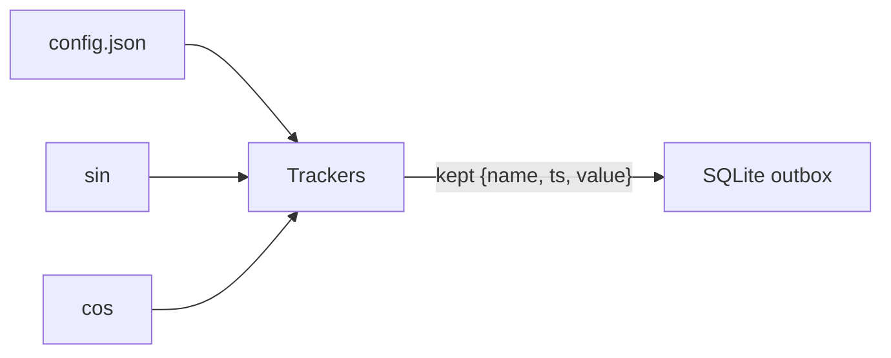
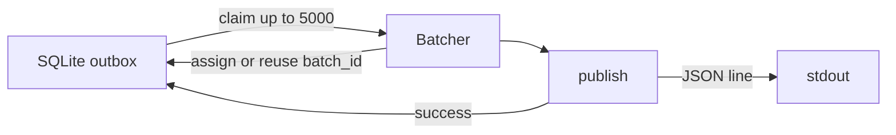

# Durable telemetry tracker

Node.js 24 + TypeScript app with two stages:

1. **Tracking** — sample virtual `sin`/`cos` sources, keep interesting values, store them in a local SQLite outbox.
2. **Forwarding** — every 10s publish unpublished messages in batches of at most 5,000 over an unreliable stdout channel.

## Design

### Tracking




- **Sampling** — Each tracker is scheduled about every `sampleMs`, but the real interval can drift (timer jitter, event-loop delay, a slow previous append). When a tick runs, it uses the current execution time `Date.now()` as `ts` and passes that into the source, e.g. `sin(ts)` / `cos(ts)` — not a perfect grid of `t0, t0+sampleMs, t0+2·sampleMs`.
  - *Example:* `sampleMs` is 1000. Tick A runs at `ts=1000` and keeps `sin(1000)`. The next timer is due at ~2000, but the event loop is busy, so Tick B actually runs at `ts=2037`. The value stored is `sin(2037)`, and the gap between kept samples is 1037 ms, not exactly 1000 ms.
- **Keep rules** — A sample is kept when:
  - it is the first sample of this process, or
  - `|value - lastKept| >= precision`, or
  - more than 15 seconds have passed since the last **kept** sample (heartbeat).
- **Message shape** — Kept samples become `{ name, ts, value }` and are appended to SQLite with `INSERT OR IGNORE` on `(name, ts)`.
- **In-memory lastKept** — Tracker state is process-local only; after a restart the next sample is always kept.
- **Async append** — `lastKept` is updated only after a successful outbox write; a failed append leaves state unchanged and the sample is dropped.
- **Config validation** — Rejects empty name, unknown source, `sampleMs < 1000`, invalid precision, and duplicate `name`+`sampleMs`.

### Forwarding




- **Outbox states** — Each message has `batch_id` and `published`:
  - **pending** — not yet assigned a batch
  - **in flight** — has a `batch_id`, not yet published
  - **published** — `publish` resolved successfully
- **Claim every 10s** — Reuse any in-flight `batch_id` to retry sending that batch again. If there is no in-flight batch, assign a new UUID to up to 5,000 pending rows, update them in the DB, and send them as one batch.
- **Publish** — Writes one JSON line `{ batch_id, messages }` to stdout; fails at random (reject, hang, write-then-reject).
- **Retry same batch_id** — On failure the batch stays in flight; the next attempt reuses the same id.
- **Mark published only on success** — New pending messages wait until the current in-flight batch is done.
- **Receiver deduplication** — Deduplicates on `batch_id`, so retries can appear more than once on the wire safely.

## Run

1. Install [Node.js 24](https://nodejs.org/) if it is not already installed.
2. Clone the repository and enter the project folder:

```bash
git clone <repo-url>
cd durable-telemetry-tracker
```

1. Install dependencies and start:

```bash
npm install
npm start
```

Reads `config.json` (validated on startup), writes kept messages to `data/outbox.sqlite`, publishes batches as JSON lines on **stdout**, logs to **stderr**. Stop with Ctrl+C.

### Tests

```bash
npm test
```

Integration tests (happy and sad paths):

- `tests/tracking.test.ts` — config → keep rules → outbox. Covers first sample, significant change, heartbeat, restart freshness, failed append (no `lastKept` update), high precision drops, duplicate `(name, ts)`, and config validation.
- `tests/forwarding.test.ts` — outbox → claim → publish. Covers successful publish, empty outbox, same `batch_id` on reject/timeout/write-then-reject, 5,000-message batch cap, and retrying a failed batch before new pending events.
- `tests/tracking1000.test.ts` — scale/concurrency with 1,000 Trackers (`config1000.json)`. Covers slow-write overlap safety, 1,000 trackers just keep their first sample and 1,000 trackers with slow writes (DB matches an in-memory kept list).

## Guarantees

- **Durable outbox after commit** — Once `append` commits, the message is still there after a process restart.
  - *Does not hold if:* the process dies during the write (transaction not committed). With `synchronous=NORMAL`, an OS/power crash can also lose the latest committed transaction(s) even though the DB stays usable.
- **`(name, ts)` uniqueness** — Each message is identified by `name`+`ts`. The outbox primary key plus `INSERT OR IGNORE` ensures at most one row per pair.
- **Batch size cap** — A claimed batch has at most 5,000 messages.
- **No loss to the cloud (at-least-once on the wire)** — Every committed outbox message is eventually published to stdout if the app keeps running long enough for retries to succeed.
  - *Does not hold if:* the process is stopped permanently, the DB file is deleted/corrupted outside the app, or generation outpaces delivery for long enough that the unpublished backlog grows without bound (see **Backpressure when ingress outpaces forwarding** under Left out).
- **No duplicates after** `batch_id` **deduplication** — A message is assigned one `batch_id` and stays on that batch until published. Retries reuse the same id. After the receiver deduplicates by `batch_id`, each message appears once.
  - *Does not hold if:* the receiver does not deduplicate on `batch_id` (write-then-reject and timeouts can put the same batch on stdout more than once).
- **Crash safety** — The outbox stays usable after a crash, including if the process died in the middle of a write. Incomplete transactions are rolled back on open; in-flight batches are retried with the same `batch_id` after restart.
  - *Does not hold if:* the disk/filesystem itself is damaged, or someone edits/deletes `data/outbox.sqlite` by hand.
- **Tracker restart semantics** — After restart, each tracker’s first sample is kept again (`lastKept` is not persisted).
  - *Does not hold as “no extra samples”:* restart can re-keep a value that would not have been kept in a continuous run. That is intentional per the challenge.

## Left out

- **Deleting / compacting published rows** — Published messages stay in SQLite forever. Left out to keep the outbox simple and auditable; compaction is a separate retention concern.
- **Multiple concurrent in-flight batches** — At most one in-flight batch at a time. Left out so `batch_id` reuse and crash recovery stay easy to reason about; parallelism would need locking and more careful claim logic.
- **Metrics, dashboards, structured logging** — Only stderr logs. Left out to stay focused on the durability path; ops tooling can wrap the process later.
- **External brokers / remote DBs** — Embedded SQLite only. Left out because the challenge forbids external services and local durability is the point.
- **Multi-process / multi-host outbox** — Single process assumes exclusive use of the DB file. Left out to avoid distributed locking.
- **Busy flag / skipped intervals** — Overlapping ticks while an append is in process are skipped so keep-state is not corrupted. This can lose some sampling intervals, especially when many trackers update the outbox at once and appends are delayed.
- **Backpressure when ingress outpaces forwarding** — In the worst case, 1,000 trackers updating the outbox every second can add far more than 5,000 messages per 10 s(up to 10,000), while forwarding sends at most 5,000 per 10 s. Unpublished messages can accumulate; this backlog case is not handled (no shedding, throttling or faster drain).

